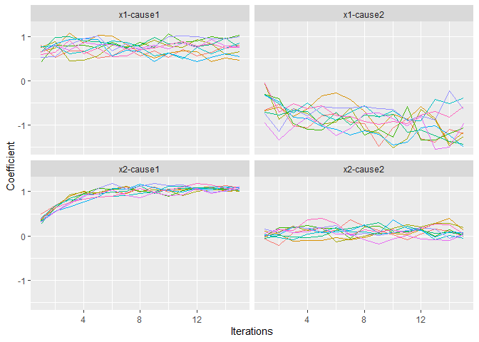

<!-- README.md is generated from README.Rmd. Please edit that file -->

# parlSMCFCS

The
[`mice::parlmice`](https://www.gerkovink.com/parlMICE/Vignette_parlMICE.html)
alternative for the
[smcfcs](https://cran.r-project.org/web/packages/smcfcs/index.html)
package: a basic wrapper that allows to run the imputations in parallel.

This can save a substantial amount of computing time, particularly in
cases when continuous variables are imputed and rejection sampling is
needed.

## Installation

You can install the package with:

``` r
devtools::install_github("edbonneville/parlSMCFCS")
```

## Example

Load the library

``` r
library(parlSMCFCS)
```

Run the imputations on 3 cores

``` r
# Load

# Detect number of cores
parallel::detectCores() 

imps <- parlSMCFCS::parlsmcfcs(
  seed = 2021,
  n_cores = 3, # number of cores - 1
  originaldata = smcfcs::ex_compet,
  m = 10,
  smtype = "compet",
  smformula = list(
    "Surv(t, d == 1) ~ x1 + x2",
    "Surv(t, d == 2) ~ x1 + x2"
  ),
  numit = 15,
  method = c("", "", "norm", "norm")
)

plot(imps)
```



## Possible benchmarks..
