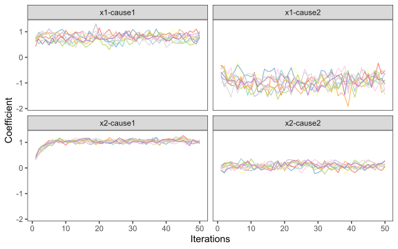
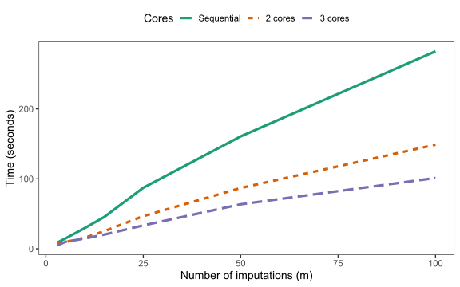

<!-- README.md is generated from README.Rmd. Please edit that file -->

# parlSMCFCS

**Development moved permanently moved to
[smcfcs::smcfcs.parallel](https://github.com/jwb133/smcfcs/blob/master/R/smcfcs_parallel.r)
:-)**

–

The
[`mice::parlmice()`](https://www.gerkovink.com/parlMICE/Vignette_parlMICE.html)
alternative for the
[smcfcs](https://cran.r-project.org/web/packages/smcfcs/index.html)
package: a basic wrapper that allows to run the substantive model
compatible imputations in parallel.

It uses the parallel package as backend, and supports a progress bar
through the use of the [pbapply](https://github.com/psolymos/pbapply)
package.

## Installation

You can install the package with:

``` r
devtools::install_github("edbonneville/parlSMCFCS")
```

Otherwise, you can simply download the single [R script](R/parlsmcfcs.R)
and source it directly (assuming dependencies have been installed).

## Example

``` r
library(parlSMCFCS)
library(ggplot2)
```

First, check the number of available cores on your machine:

``` r
# Detect number of cores
parallel::detectCores() 
#> [1] 4
```

Then, you can run the imputations with the exact same arguments as
[`smcfcs::smcfcs()`](https://www.rdocumentation.org/packages/smcfcs/versions/1.4.2/topics/smcfcs).
The only additional arguments to include are

-   `n_cores`: the number of cores to use. It is recommended to leave at
    least one free core on your machine for other tasks.
-   `cl_type`: the type of cluster to start, either “PSOCK” (recommended
    for windows) or “FORK” (recommended for Linux/Mac).
-   `seed`: optional seed value to reproduce the analysis. If run in
    parallel this is set with `parallel::clusterSetRNGStream(seed)`,
    otherwise with `n_cores = 1` it is simply set as `set.seed(seed)`.

Additional optional arguments include

-   `m_per_core`: specifies number of imputed datasets per core, should
    you want to override the default of speading `m` across the
    `n_cores` as equally as possible.
-   `outfile`: path to a .txt file to store any printed output, such as
    rejection sampling warnings.

We run `m = 10` imputations on the
[`smcfcs::ex_compet`](https://www.rdocumentation.org/packages/smcfcs/versions/1.4.2/topics/ex_compet)
dataset from the smcfcs package, which has two continuous covariates
with missing data with a competing risks substantive model. We run them
on 3 cores as follows

``` r
imps <- parlSMCFCS::parlsmcfcs(
  seed = 2021,
  n_cores = 3, # number of cores - 1
  originaldata = smcfcs::ex_compet,
  m = 10,
  smtype = "compet",
  smformula = list(
    "Surv(t, d == 1) ~ x1 + x2",
    "Surv(t, d == 2) ~ x1 + x2"
  ),
  numit = 50,
  method = c("", "", "norm", "norm")
)

plot(imps)
```



## Benchmarks

On the same
[`smcfcs::ex_compet`](https://www.rdocumentation.org/packages/smcfcs/versions/1.4.2/topics/ex_compet)
dataset, benchmarks were run for different `m` and `n_cores` using the
[microbenchmark](https://github.com/joshuaulrich/microbenchmark) package
with 5 replications. These were run on
[SLURM](https://slurm.schedmd.com/documentation.html) cluster with
`cl_type = "FORK"`. Below the mean computation times are plotted


